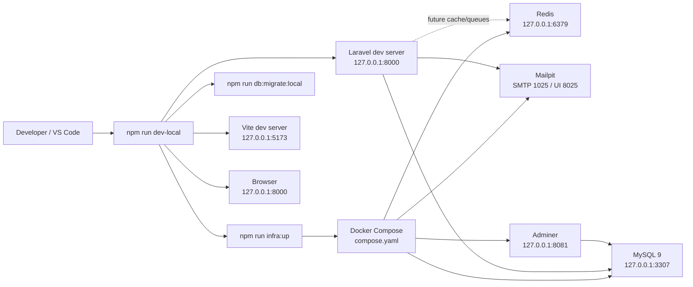

# CS85 PHP Programming

Expandable Laravel workspace for Santa Monica College CS85, Summer 2026.

This repository is more than a disposable course sandbox. It is a single Laravel
application that keeps weekly coursework, labs, notes, project experiments, and
the final project in one organized codebase while preserving professional
Laravel boundaries.

## Project Goals

- Practice PHP fundamentals, forms, Composer, routing, Blade, databases,
  authentication, authorization, and Laravel application structure.
- Keep all CS85 work in one versioned repository instead of separate loose
  folders.
- Make each assignment easy to submit with a stable local URL and a GitHub file
  link.
- Keep the Laravel `public/` directory limited to the front controller and
  browser-safe assets, so source code, configuration, templates, and domain
  classes are not web-served directly.
- Grow the coursework into a portfolio-quality application with tests, static
  analysis, CI, Docker-backed infrastructure, and security controls.

## Current Status

The project currently includes:

- Public Laravel pages for home, roadmap, stack, and contact.
- A 12-module CS85 roadmap driven by `config/course.php`.
- Session authentication with email/password registration and login.
- GitHub OAuth login and authenticated account connection.
- A protected user cabinet and admin-only cabinet area.
- Editable profile fields for first name, last name, portfolio links, bio, and
  technical skills.
- Security headers and a strict Content Security Policy.
- Docker Compose services for MySQL, Redis, Mailpit, and Adminer.
- Assignment pages served through Laravel routes.
- A Module 9 Contact List CRUD workbench with a versioned JSON importer,
  Eloquent relationships, filters, validation, and complete UI operations.
- PHPUnit feature and unit tests.
- A local-first AI learning assistant with persistent multi-turn conversations, streaming LM Studio responses, specialized model routing, and read-only course tools.
- Laravel Pint, Larastan/PHPStan, Prettier, Vite build checks, and GitHub
  Actions CI.

## Stack

- PHP 8.5 locally through Homebrew
- PHP 8.4 in GitHub Actions CI
- Laravel 13
- Composer 2
- Blade templates
- Tailwind CSS 4 through Vite
- Docker Compose local infrastructure
- MySQL 9 for local persistent development data
- SQLite for fast testing and default Laravel startup
- Redis prepared for future cache and queue work
- Mailpit for local email testing
- Adminer for local database inspection
- PHPUnit for tests
- Laravel Pint for PHP formatting
- Larastan/PHPStan for static analysis
- Prettier for project documentation, JavaScript, and workflow formatting
- OpenAI PHP client reserved for the final project

## Architecture

Detailed engineering documentation is maintained under [`docs/`](docs/README.md):

- [Authentication and Account Security](docs/authentication/README.md)
- [Authentication Architecture](docs/authentication/architecture.md)
- [Authentication Audit Events](docs/authentication/audit-events.md)
- [Authentication Operations Runbook](docs/authentication/operations.md)
- [Authentication Testing Strategy](docs/authentication/testing.md)
- [AI Platform SRS](docs/AI_PLATFORM_SRS.md)

```text
app/                         Laravel application code
app/Http/Controllers         Auth, assignment, cabinet, and workflow controllers
app/Http/Middleware          Security and role middleware
app/Models                   Eloquent models
app/Services/Modules         Reusable coursework services and domain classes
assignments/                 Course assignment source files outside public web root
bootstrap/                   Laravel application bootstrap
config/                      Application, course, security, navigation, and cabinet config
database/factories           Test and seed factories
database/migrations          Database schema changes
database/seeders             Seed data
final-project/               Future AI-powered final project workspace
labs/                        Practice exercises
notes/                       Course notes and reading summaries
projects/                    Larger module projects
public/                      Laravel front controller, compiled assets, favicons, robots, sitemap
resources/css                Tailwind CSS entrypoint
resources/js                 Vite JavaScript entrypoint
resources/views              Blade pages, layouts, cabinet screens, and partials
routes/web.php               Public, assignment, auth, cabinet, and admin web routes
scripts/                     Local development and infrastructure automation
storage/                     Laravel runtime storage
tests/Feature                Route, security, auth, cabinet, and workflow tests
tests/Unit                   Configuration, pricing, and project invariant tests
```

## Public Directory Policy

`public/` is intentionally limited to browser-safe files:

- `index.php`
- compiled Vite assets under `public/build`
- brand images and favicons
- `robots.txt`, `sitemap.xml`, and web manifests

Coursework PHP source files do not live in `public/`. Assignment source files
live in `assignments/`, and reusable PHP classes live under `app/Services`.
Laravel routes expose only allowlisted assignment pages.

This keeps the project closer to production Laravel conventions:

- source code is not directly web-browsable
- configuration is not exposed as public files
- templates and domain classes remain inside application-controlled paths
- URLs are registered explicitly in `routes/web.php`

## Assignment Structure

Current assignment source layout:

```text
assignments/module2a/
  order.php
  price_engine.php
  price_engine_refactored.php
  receipt.php

assignments/module3a/
  ContactForm.php

assignments/module3b/
  SecureProductContactForm.php

assignments/module4a/
  database-setup.php

assignments/module4b/
  show_inventory.php

assignments/module9a/
  README.md
  data/contacts.json
```

Reusable Module 2A classes:

```text
app/Services/Modules/Module2A/
  Application/
  Domain/
  Presentation/
```

Canonical assignment URLs:

| Assignment                            | Local URL                                                                 |
| ------------------------------------- | ------------------------------------------------------------------------- |
| Module 2A price engine                | `http://127.0.0.1:8000/assignments/module2a/price_engine.php`             |
| Module 2A refactor                    | `http://127.0.0.1:8000/assignments/module2a/price_engine_refactored.php`  |
| Module 3A contact form review         | `http://127.0.0.1:8000/assignments/module3a/ContactForm.php`              |
| Module 3B secure product contact form | `http://127.0.0.1:8000/assignments/module3b/SecureProductContactForm.php` |
| Module 4A database setup              | `http://127.0.0.1:8000/assignments/module4a/database-setup.php`           |
| Module 4B personal inventory database | `http://127.0.0.1:8000/assignments/module4b/show_inventory.php`           |

Legacy URLs such as `/module4b/show_inventory.php` are still routed through
Laravel for compatibility, but new submissions should use `/assignments/...`
URLs and GitHub links under the `assignments/` directory.

Example submission link:

```text
https://github.com/sergehall/cs85-php-programming/blob/main/assignments/module4b/show_inventory.php
```

## Assignment Routing

`App\Http\Controllers\Assignments\AssignmentPhpPageController` is a transitional
bridge for early course assignments that are still written as single PHP files.
It only serves files listed in its allowlist.

The professional target is:

```text
Route -> Controller -> Form Request -> Service/Action -> Blade View -> Tests
```

Use the bridge for course-required single-file PHP assignments. For larger or
newer assignments, prefer Laravel controllers, services, Blade templates,
database migrations, models, and tests.

## Adding New Coursework

For a simple course-required PHP file:

1. Create a folder under `assignments/`, for example `assignments/module5a/`.
2. Add the assignment PHP file there.
3. Register the file in the assignment controller allowlist.
4. Add a route entry in `routes/web.php`.
5. Add the assignment to `config/course.php`.
6. Add a feature test that verifies the assignment URL returns `200`.
7. Run `composer quality` and `npm run quality`.

For a Laravel-native assignment:

1. Add a controller under `app/Http/Controllers/Assignments`.
2. Put business logic in `app/Services/Modules/ModuleX`.
3. Put the Blade view under `resources/views/pages/assignments`.
4. Register a named route in `routes/web.php`.
5. Add the named route to `config/course.php`.
6. Add feature and unit tests.

## Runtime Architecture

The Laravel application runs on macOS through PHP, Composer, Node.js, and Vite.
Project infrastructure runs in Docker Compose and persists between sessions.



Homebrew MySQL is not required. The app connects to Docker MySQL on
`127.0.0.1:3307`, which avoids conflicts with other local database installations.

## Application Areas

| Area          | Route               | Purpose                                            |
| ------------- | ------------------- | -------------------------------------------------- |
| Home          | `/`                 | Project entry point and readiness overview         |
| Roadmap       | `/roadmap`          | CS85 module path with assignment links             |
| Module detail | `/roadmap/{module}` | Module-specific assignments, notes, and resources  |
| Stack         | `/stack`            | Installed tooling and technical foundation         |
| Contact       | `/contact`          | Course and project contact channels                |
| Register      | `/register`         | Create a standard user account                     |
| Login         | `/login`            | Session login with email/password and GitHub OAuth |
| Cabinet       | `/cabinet`          | Authenticated user workspace                       |
| Admin cabinet | `/cabinet/admin`    | Admin-only operational workspace                   |
| Health        | `/up`               | Laravel health route                               |

`/admin` redirects to `/cabinet` as a legacy convenience route.

## Authentication And Roles

The cabinet is protected with Laravel session authentication.

Supported entry points:

- Email/password registration through `/register`
- Email/password login through `/login`
- GitHub OAuth through `/auth/github/redirect`
- Email verification through signed, expiring links
- Password recovery through `/forgot-password`
- TOTP MFA and one-time recovery codes
- Recent-authentication step-up for sensitive account and admin actions
- Logout through `POST /logout`

GitHub OAuth supports two flows:

- guest sign-in from `/login`
- authenticated account connection from `/cabinet/security`

GitHub account MFA is managed inside GitHub. The application also enforces its
own TOTP MFA challenge after either password or GitHub first-factor login when
application MFA is enabled. GitHub identities must be linked explicitly from an
authenticated, recently confirmed session; matching an existing email address
does not automatically link accounts.

Authentication abuse controls include named rate limiters for login, MFA,
registration, recovery, OAuth, and sensitive actions. Security events are
written to the user/admin activity timeline and to the dedicated rotating
`storage/logs/security.log` channel without passwords, OAuth tokens, MFA codes,
or recovery codes.

The security page supports password changes, active database-session review,
individual session revocation, and revocation of every other session. Password,
MFA, role, login-access, and identity-provider changes rotate remember tokens or
revoke affected sessions as appropriate.

Roles are configured in `config/navigation.php` and enforced for admin routes
with the `admin` middleware.

- `user`: can view the cabinet, manage profile readiness, and track coursework
- `admin`: can access protected user-management and admin-only coursework tools

Newly registered and GitHub-created users receive the `user` role by default.
Admin access must be assigned intentionally.

## Cabinet Foundation

The cabinet is config-driven while the project is still early in the course.
Content lives in `config/cabinet.php`, and routes are generated from section
keys.

Prepared user areas:

- Overview
- Profile
- Coursework
- Security
- Activity

Prepared admin areas:

- Users
- Content

When database-backed coursework begins, these config-backed panels should move
into migrations, models, seeders, policies, controllers, and Blade workflows.

## Environment

Create a local environment file:

```bash
cp .env.example .env
php artisan key:generate
```

Default quick-start storage is SQLite. Docker-backed local development uses
MySQL:

```dotenv
DB_CONNECTION=mysql
DB_HOST=127.0.0.1
DB_PORT=3307
DB_DATABASE=cs85_php_programming
DB_USERNAME=cs85
DB_PASSWORD=cs85_password
CACHE_STORE=database
QUEUE_CONNECTION=database
MAIL_MAILER=smtp
MAIL_HOST=127.0.0.1
MAIL_PORT=1025
```

GitHub OAuth:

```dotenv
GITHUB_CLIENT_ID=
GITHUB_CLIENT_SECRET=
GITHUB_REDIRECT_URI="${APP_URL}/auth/github/callback"
```

Final project AI integration:

```dotenv
AI_PROVIDER=lm_studio
AI_LM_STUDIO_BASE_URL=http://127.0.0.1:1234/v1
AI_LM_STUDIO_API_KEY=lm-studio
```

Start the LM Studio local server on port `1234` and load the model configured
for the selected General, Coding, or Architecture mode. Follow the complete
[local AI setup guide](docs/architecture/ai-local-setup.md) for required LM
Studio settings, model verification, startup order, streaming checks, and
troubleshooting. The rest of the Laravel application continues to work when LM
Studio is offline.

Never commit real secrets.

## Commands

Install dependencies:

```bash
composer install
npm install
```

Prepare the Laravel app:

```bash
cp .env.example .env
php artisan key:generate
php artisan migrate
```

Start the full local stack:

```bash
npm run dev-local
```

Local startup routes email to Mailpit by default. To use the SMTP credentials
from `.env` instead, set the explicit opt-out and restart the full stack:

```env
CS85_USE_MAILPIT=false
```

The startup log prints either `Mailpit` or `external SMTP from .env` without
exposing credentials. Keep the default enabled unless real delivery is the
specific test objective.

Aliases:

```bash
npm run dev
npm run start:app
```

Stop the Laravel and Vite processes started by this project:

```bash
npm run stop:app
```

Stop any existing local application instance and start a fresh one:

```bash
npm run restart:app
```

Both commands verify that the process belongs to this project before stopping
it. Docker infrastructure and database volumes remain running and are not
deleted.

Run only Laravel:

```bash
php artisan serve --host=127.0.0.1 --port=8000
```

Run only Vite:

```bash
npm run dev:assets
```

Build frontend assets:

```bash
npm run build
```

Run Docker MySQL migrations:

```bash
npm run db:migrate:local
```

## Docker Infrastructure

| Service      | URL / Port              | Purpose                   |
| ------------ | ----------------------- | ------------------------- |
| MySQL        | `127.0.0.1:3307`        | Local Laravel database    |
| Redis        | `127.0.0.1:6379`        | Cache-ready local service |
| Mailpit UI   | `http://127.0.0.1:8025` | Local email inbox         |
| Mailpit SMTP | `127.0.0.1:1025`        | Local SMTP endpoint       |
| Adminer      | `http://127.0.0.1:8081` | Database browser          |

Default MySQL credentials:

```text
database: cs85_php_programming
username: cs85
password: cs85_password
```

Start infrastructure:

```bash
npm run infra:up
```

Stop infrastructure but keep containers and volumes:

```bash
npm run infra:down
```

Remove Compose containers without deleting data volumes:

```bash
npm run infra:destroy
```

Use `npm run infra:down` for normal shutdown. Use `npm run infra:destroy` only
when you want Docker Desktop to remove the stopped containers. Avoid deleting
Docker volumes unless you intentionally want to reset local data.

## Quality Gates

Run PHP tests:

```bash
php artisan test
```

Run PHP formatting:

```bash
composer format
```

Run PHP formatting check:

```bash
composer format:check
```

Run PHP static analysis:

```bash
composer lint
```

Run PHP quality gate:

```bash
composer quality
```

Run documentation, workflow, and frontend formatting:

```bash
npm run format
```

Run frontend/documentation quality gate:

```bash
npm run quality
```

Run the full local gate:

```bash
npm run test:all
```

Run dependency audits when network access is available:

```bash
npm run test:all:audit
```

Recommended before committing:

```bash
composer quality
npm run quality
```

## CI

GitHub Actions runs on pushes and pull requests to `main`.

The CI workflow:

- validates Composer configuration
- installs PHP dependencies
- creates a testing `.env`
- generates a Laravel app key during the run
- runs migrations against SQLite
- runs `composer quality`
- audits PHP dependencies
- installs Node.js dependencies
- runs `npm run quality`
- audits Node.js dependencies

The workflow should never store a real `APP_KEY`, OAuth secret, database
password, or API key in repository files.

## Security Controls

The app sends security headers through `App\Http\Middleware\SecurityHeaders`.

Current controls:

- authenticated cabinet security hub at `/cabinet/security`
- GitHub OAuth login and account linking with state validation
- explicit GitHub linking with verified primary email checks
- GitHub account ownership checks before linking an authenticated user
- email verification and password reset notifications
- TOTP MFA challenge TTL, replay protection, and hashed one-time recovery codes
- recent password, MFA, or GitHub step-up for sensitive changes
- per-flow rate limiting for authentication and recovery endpoints
- active-session review and revocation
- structured security audit events plus a dedicated rotating security log
- strict Content Security Policy with `default-src 'none'`
- `script-src 'self'` and `style-src 'self'`
- no `unsafe-inline` or `unsafe-eval` in production policy
- `object-src 'none'`
- `base-uri 'none'`
- `form-action 'self'`
- `frame-ancestors 'none'`
- HSTS outside local development
- `X-Content-Type-Options: nosniff`
- `X-Frame-Options: DENY`
- `Referrer-Policy: strict-origin-when-cross-origin`
- `Cross-Origin-Resource-Policy: same-origin`
- `Cross-Origin-Opener-Policy: same-origin`
- Vite production assets with Subresource Integrity hashes

Local development allows the Vite dev server only when `APP_ENV=local` and
`APP_DEBUG=true`.

## Test Coverage

The test suite currently verifies:

- public pages render successfully
- roadmap modules and assignment links stay registered
- assignment PHP pages render through Laravel
- authenticated users can edit profile identity, portfolio links, bio, and
  technical skills
- Module 2A pricing rules and escaping behavior
- security headers and CSP expectations
- registration, login, logout, GitHub OAuth, and GitHub account linking behavior
- email verification, password reset/change, and email normalization
- login/MFA rate limiting and failed-attempt audit behavior
- MFA challenge expiry, TOTP replay resistance, and recovery-code consumption
- recent-authentication step-up for security and admin mutations
- session ownership checks and session revocation
- guests are redirected from protected cabinet pages
- user and admin cabinet access boundaries
- standard users cannot access admin cabinet pages
- navigation config points only to registered routes
- role rules keep user and admin abilities separated
- SEO assets, robots, sitemap, and brand files exist
- CSS entrypoint remains Tailwind-only

## Development Standards

- Keep new source code, configuration, templates, and domain classes out of
  `public/`.
- Prefer named routes over hardcoded URLs for Laravel-native pages.
- Keep controllers thin; move business logic into services or actions.
- Use Form Request classes when an assignment becomes a real Laravel form.
- Escape output in raw PHP assignments with `htmlspecialchars`.
- Use Laravel CSRF protection for POST forms.
- Add tests for every new public route and important business rule.
- Keep `resources/css/app.css` as a Tailwind entrypoint only.
- Keep secrets in `.env`, not in repository files.

## Professional Upgrade Path

Near-term improvements:

- Move the assignment allowlist into `config/assignments.php`.
- Replace raw PHP assignment routes with named routes where possible.
- Add POST feature tests for Module 3A, Module 3B, and Module 4A forms.
- Convert Module 4B from raw PDO to Laravel migrations, seeders, Eloquent, a
  controller, and a Blade table.

Mid-course improvements:

- Add Form Request validation for write workflows.
- Add policies for user-owned cabinet records.
- Persist coursework, profile, and activity in MySQL.
- Add CRUD flows for assignments, labs, notes, and final project milestones.
- Add admin audit logging for protected operations.

Final project improvements:

- Add server-side OpenAI API calls with environment-only API keys.
- Track AI request cost and usage.
- Add rate limiting and abuse protection.
- Add deployment documentation.
