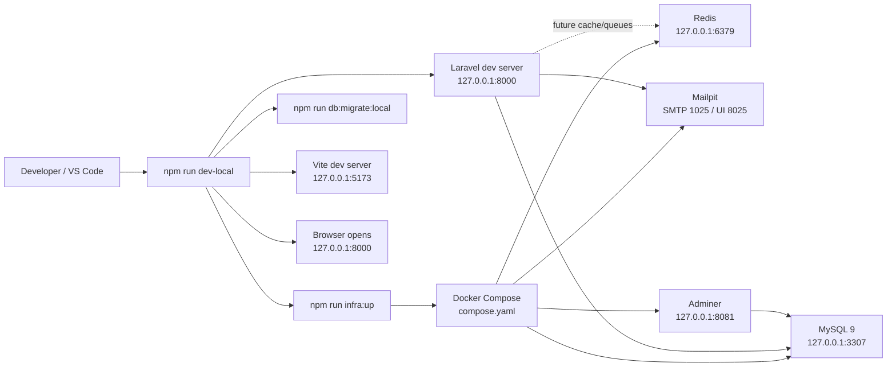

# CS85 PHP Programming

Expandable Laravel workspace for Santa Monica College CS85, Summer 2026.

This project is intentionally structured as more than a disposable course sandbox. It starts with the CS85 syllabus requirements, then leaves clean extension points for database-backed CRUD, user cabinet workflows, admin-only operations, and an AI-powered final project.

## Goals

- Practice PHP fundamentals, object-oriented PHP, forms, Composer, Laravel routing, Blade views, and MySQL-backed web development.
- Keep assignments, labs, notes, projects, and final-project work in one organized repository.
- Build toward a three-tier Laravel application with a public area, user cabinet, prepared admin rules, database persistence, tests, and AI integration.
- Maintain portfolio-quality habits from the beginning: readable structure, reproducible commands, documented architecture, and quality gates.

## Stack

- PHP 8.5 via Homebrew
- Laravel 13
- Composer 2
- Blade templates
- Tailwind CSS 4 through Vite
- Docker Compose local infrastructure
- MySQL 9 for local database persistence
- Redis for cache-ready local development
- Mailpit for local email testing
- Adminer for database inspection
- SQLite for fast default Laravel startup
- PHPUnit feature tests
- Laravel Pint formatting
- Larastan and PHPStan static analysis
- Prettier formatting for JavaScript and project documentation
- Laravel Debugbar for local debugging
- Laravel Tinker for interactive exploration
- OpenAI PHP client for the final project

## Architecture

```text
app/                    Laravel application code
app/Http/Controllers    Auth and future workflow controllers
app/Http/Middleware     Role middleware for protected cabinet areas
config/course.php        CS85 roadmap, stack, and contact data
config/navigation.php    Public, cabinet, admin, and role navigation rules
database/migrations      Users, sessions, jobs, cache, and auth profile schema
routes/web.php           Public, auth, cabinet, and admin routes
resources/views/layouts  Shared Blade application layout
resources/views/pages    Public pages
resources/views/cabinet  User cabinet and admin-rule pages
resources/views/partials Shared Blade partials
resources/css/app.css    Tailwind entrypoint only
scripts/                 Local app and infrastructure automation
compose.yaml             Persistent Docker Compose infrastructure
tests/Feature            Route, navigation, and access-surface tests
tests/Unit               Configuration and project invariant tests
.github/workflows        GitHub Actions quality automation
assignments/             Weekly assignment work
labs/                    Practice exercises
notes/                   Course notes and reading summaries
projects/                Larger module projects
final-project/           AI-powered final project work
```

## Runtime Architecture

The Laravel application runs on the host machine through PHP, Composer, Node.js, and Vite. Project infrastructure runs in Docker Compose and is reused between sessions.



The application layer and infrastructure layer are intentionally separated:

| Layer       | Runs on    | Responsibility                                               |
| ----------- | ---------- | ------------------------------------------------------------ |
| Laravel app | macOS host | Routes, Blade views, PHP application code, migrations, tests |
| Vite        | macOS host | Tailwind CSS and frontend asset development                  |
| MySQL       | Docker     | Persistent local database for course CRUD work               |
| Redis       | Docker     | Prepared cache/queue service for future Laravel features     |
| Mailpit     | Docker     | Local email capture without real SMTP credentials            |
| Adminer     | Docker     | Lightweight database browser for the Docker MySQL service    |

Homebrew MySQL is not required for this project. The app connects to Docker MySQL on `127.0.0.1:3307`, which avoids conflicts with other local database installations.

## Application Areas

| Area        | Route                 | Purpose                                                        |
| ----------- | --------------------- | -------------------------------------------------------------- |
| Home        | `/`                   | Project entry point and current readiness overview             |
| Roadmap     | `/roadmap`            | CS85 eight-module path with links to module workspaces         |
| Stack       | `/stack`              | Installed tooling and technical foundation                     |
| Contact     | `/contact`            | Course and project contact channels                            |
| Login       | `/login`              | Session login with email/password and GitHub OAuth             |
| Register    | `/register`           | Create one standard user account for cabinet access            |
| Cabinet     | `/cabinet`            | Authenticated user workspace                                   |
| Profile     | `/cabinet/profile`    | Prepared user profile area                                     |
| Coursework  | `/cabinet/coursework` | Prepared assignments, labs, notes, and final-project workspace |
| Messages    | `/cabinet/messages`   | Prepared user message area                                     |
| Security    | `/cabinet/security`   | Prepared account protection and authorization planning area    |
| Activity    | `/cabinet/activity`   | Prepared project and future user activity timeline             |
| Admin Tools | `/cabinet/admin`      | Admin-only operational area inside the cabinet                 |

`/admin` is kept as a legacy convenience route and redirects to `/cabinet`.

Each roadmap module has its own public page under `/roadmap/{module-slug}`. These pages are intentionally empty workspaces for now and will collect assignments, notes, and resources as the course progresses.

## Authentication

The cabinet is protected with Laravel session authentication.

Supported entry points:

- Email and password login through `/login`
- Account creation through `/register`
- GitHub OAuth through `/auth/github/redirect`
- Logout through `POST /logout`

Google OAuth is intentionally not registered in this project.

GitHub OAuth uses a session-backed state value before redirecting to GitHub and validates the state on callback. User records store the GitHub id, username, avatar URL, verified email, and the local role.

Configure GitHub OAuth in `.env`:

```dotenv
GITHUB_CLIENT_ID=
GITHUB_CLIENT_SECRET=
GITHUB_REDIRECT_URI="${APP_URL}/auth/github/callback"
```

## Roles

Role intent lives in `config/navigation.php` and is enforced for admin routes by middleware.

- `user`: can view the cabinet, manage their own profile, track coursework, and send messages.
- `admin`: can access future operational tools for users, content, and message review.

Newly registered and GitHub-created users receive the `user` role by default. Admin access must be assigned intentionally in the database or a future admin workflow.

## Cabinet Foundation

The cabinet follows the focused-section pattern used in the CS79D final project, adapted for Laravel and CS85:

- `Overview`: account summary, metrics, prepared roles, and activity preview
- `Profile`: user identity, portfolio links, editable profile fields, and persistence path
- `Coursework`: assignments, labs, notes, projects, and final-project workspace planning
- `Messages`: future inbox, contact requests, reviewed states, and Mailpit-ready email flow
- `Security`: authentication, policies, MFA/OAuth ideas, and audit-readiness notes
- `Activity`: project evidence stream and future database-backed event log
- `Admin`: users, content, and message review surfaces protected by admin middleware

The content currently lives in `config/cabinet.php` so the pages can grow without duplicating arrays across Blade views. When database work starts, these config-backed panels should move into models, migrations, seeders, policies, and controllers.

Cabinet extensibility is intentionally config-first:

```text
config/cabinet.php
  navigation.user       User cabinet navigation registry
  navigation.admin      Admin cabinet navigation registry
  sections              User section registry; routes are generated from keys
  admin.sections        Admin section registry; routes are generated from keys
  extension_points      Notes for future auth, CRUD, and database-backed upgrades
```

To add a user cabinet section, add a new key under `sections`, add a navigation item under `navigation.user`, and the `/cabinet/{key}` route will be registered automatically. Admin sections work the same way under `admin.sections` and `navigation.admin`.

## Commands

Install dependencies:

```bash
composer install
npm install
```

Prepare the Laravel app:

```bash
cp .env.example .env
php artisan key:generate
php artisan migrate
```

Start the full local application:

```bash
npm run dev-local
```

This command runs Docker infrastructure first, then starts Laravel, Vite, and opens the app in the browser.
It also runs local MySQL migrations before the Laravel server starts.

Alias:

```bash
npm run dev
npm run start:app
```

Run only the frontend asset dev server:

```bash
npm run dev:assets
```

Run only the Laravel server:

```bash
php artisan serve --host=127.0.0.1 --port=8000
```

Build frontend assets:

```bash
npm run build
```

Run local MySQL migrations against Docker infrastructure:

```bash
npm run db:migrate:local
```

Run tests:

```bash
php artisan test
```

Run PHP formatting:

```bash
composer format
```

Run PHP formatting check:

```bash
composer format:check
```

Run PHP static analysis:

```bash
composer lint
```

Auto-fix PHP style and then run static analysis:

```bash
composer lint-fix
```

VS Code npm script alias:

```bash
npm run lint-fix
```

Run the PHP quality gate:

```bash
composer quality
```

Run frontend/documentation formatting:

```bash
npm run format
```

Run frontend/documentation formatting check:

```bash
npm run format:check
```

Run frontend quality gate:

```bash
npm run quality
```

Check that GitHub Actions workflows do not contain hardcoded Laravel app keys:

```bash
npm run security:ci
```

## Docker Infrastructure

The local infrastructure is managed with Docker Compose:

| Service      | URL / Port              | Purpose                   |
| ------------ | ----------------------- | ------------------------- |
| MySQL        | `127.0.0.1:3307`        | Local Laravel database    |
| Redis        | `127.0.0.1:6379`        | Cache-ready local service |
| Mailpit UI   | `http://127.0.0.1:8025` | Local email inbox         |
| Mailpit SMTP | `127.0.0.1:1025`        | Local SMTP endpoint       |
| Adminer      | `http://127.0.0.1:8081` | Database browser          |

Docker Compose uses the project name `cs85-php-programming`, so containers and volumes are namespaced for this repository:

```text
cs85-mysql
cs85-redis
cs85-mailpit
cs85-adminer
cs85-php-programming_mysql-data
cs85-php-programming_redis-data
```

Default database credentials:

```text
database: cs85_php_programming
username: cs85
password: cs85_password
```

Start infrastructure:

```bash
npm run infra:up
```

Stop infrastructure:

```bash
npm run infra:down
```

Remove infrastructure containers from Docker Desktop without deleting data volumes:

```bash
npm run infra:destroy
```

Alias:

```bash
npm run stop:infra
```

`infra:up` starts Docker Compose services with `--no-recreate`, waits until MySQL accepts connections inside the container, and reuses the same project environment after the first creation.
If Docker Desktop is not running on macOS, the script opens it and waits for Docker to become ready.
`infra:down` runs `docker compose stop`, so containers stay visible in Docker Desktop as stopped containers and Docker volumes are preserved.
`infra:destroy` runs `docker compose down`, which removes containers and the Compose network from Docker Desktop but still preserves Docker volumes.

The environment is intentionally persistent:

- existing containers are reused on every `npm run infra:up`
- MySQL data is stored in the `cs85-php-programming_mysql-data` Docker volume
- Redis data is stored in the `cs85-php-programming_redis-data` Docker volume
- containers are removed only if you intentionally run `npm run infra:destroy` or recreate Compose definitions manually

Full local startup flow:

```text
npm run dev-local
  -> npm run infra:up
     -> open Docker Desktop if needed
     -> docker compose up -d --no-recreate
     -> wait for Docker MySQL health
  -> npm run db:migrate:local
     -> run Laravel migrations against Docker MySQL
  -> start Laravel on 127.0.0.1:8000
  -> start Vite on 127.0.0.1:5173
  -> open http://127.0.0.1:8000
```

Use `npm run infra:down` when you want to stop local services and keep the containers visible in Docker Desktop. Use `npm run infra:destroy` only when you want to remove the stopped containers from Docker Desktop. Avoid deleting Docker volumes unless you intentionally want to reset the local database.

## Environment

The default Laravel database is SQLite for quick startup.

For MySQL, update `.env`:

```dotenv
DB_CONNECTION=mysql
DB_HOST=127.0.0.1
DB_PORT=3307
DB_DATABASE=cs85_php_programming
DB_USERNAME=cs85
DB_PASSWORD=cs85_password
CACHE_STORE=database
QUEUE_CONNECTION=database
MAIL_MAILER=smtp
MAIL_HOST=127.0.0.1
MAIL_PORT=1025
```

For the AI-powered final project, keep the API key local:

```dotenv
OPENAI_API_KEY=
```

For GitHub OAuth, keep client credentials local:

```dotenv
GITHUB_CLIENT_ID=
GITHUB_CLIENT_SECRET=
GITHUB_REDIRECT_URI="${APP_URL}/auth/github/callback"
```

Never commit real secrets.

## Security Headers

The application sends MDN Observatory-friendly security headers through `App\Http\Middleware\SecurityHeaders`.

- `Content-Security-Policy` denies by default with `default-src 'none'`
- `script-src` and `style-src` do not allow `unsafe-inline` or `unsafe-eval`
- `object-src 'none'`, `base-uri 'none'`, `form-action 'self'`, and `frame-ancestors 'none'`
- `upgrade-insecure-requests` and `block-all-mixed-content`
- `Strict-Transport-Security`, `X-Content-Type-Options`, `X-Frame-Options`, and `Referrer-Policy`
- Vite production assets receive `sha384` Subresource Integrity hashes in `public/build/manifest.json`

Local development keeps Vite usable by allowing the dev server only when `APP_ENV=local` and `APP_DEBUG=true`.

## Quality Gates

Recommended before committing:

```bash
composer quality
npm run quality
composer audit
npm audit
```

Current test coverage verifies:

- public routes render successfully
- guests are redirected from the cabinet to login
- login and registration pages render the GitHub-only auth entry point
- registration creates a standard user account and enters the cabinet
- email/password login and logout work
- GitHub OAuth callback creates a user with fake HTTP responses
- `/admin` redirects to `/cabinet`
- user cabinet routes render successfully
- admin-rule routes render only for admin users
- standard users cannot open admin cabinet routes
- the old phrase `A minimal Laravel project` does not appear
- navigation config points only to registered routes
- user and admin role rules remain separated
- the roadmap exposes eight clickable module workspaces
- starter stack and contact data are ready for Blade views
- `resources/css/app.css` stays Tailwind-only
- CSP and security headers match the strict application policy

GitHub Actions runs the same quality gates on pushes and pull requests to `main`.
The workflow generates its Laravel `APP_KEY` during the CI run and does not store it in repository files.

## Development Notes

- Blade views use Tailwind utility classes only.
- `resources/css/app.css` is a Tailwind entrypoint, not a place for raw project CSS.
- Course data and navigation rules live in config files so pages can grow without duplicating arrays across views.
- Admin screens are protected by the `admin` middleware and remain ready for future policies and audit logging.
- Contact details are adapted from the Lavoval contact surface.

## Roadmap

- Persist profile, coursework, content, and messages in MySQL.
- Replace route closures with controllers as workflows become more complex.
- Add Form Request validation for write operations.
- Add policies for cabinet user ownership and admin-only actions.
- Build CRUD flows for assignments, labs, notes, and final project milestones.
- Add OpenAI-powered final project features with server-side API calls and safe key handling.
