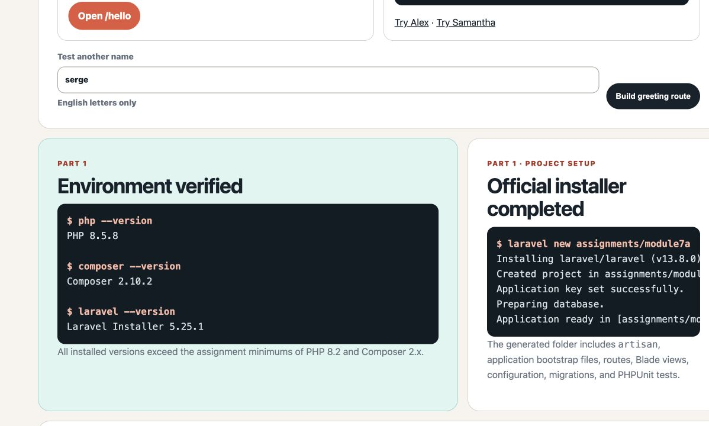
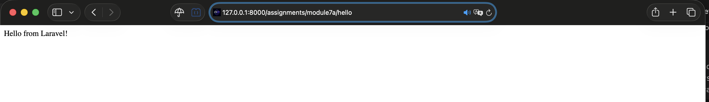
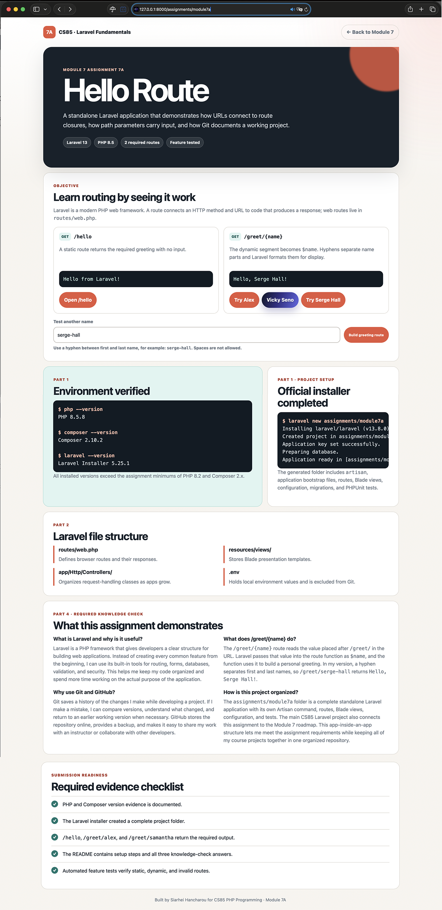

# Module 7 Assignment 7A: Hello Route

Course: CS 85 - PHP Programming

Student: Siarhei Hancharou

## Objective

This standalone Laravel application introduces framework setup, web routing, route parameters, testing, and Git-based project delivery. It also runs inside the larger CS85 coursework application so Assignment 7A remains connected to the course roadmap.

## Environment Verification

The required tools are installed and exceed the assignment minimums:

```text
$ php --version
PHP 8.5.8

$ composer --version
Composer version 2.10.2

$ laravel --version
Laravel Installer 5.25.1
```

The generated assignment uses Laravel Framework 13.19.0.

## Project Setup

The project was created with the official Laravel installer:

```bash
laravel new assignments/module7a --no-interaction --phpunit --no-boost --database=sqlite
cd assignments/module7a
```

For a fresh clone, install dependencies and prepare the local environment:

```bash
composer install
cp .env.example .env
php artisan key:generate
php artisan migrate
```

The `.env` file contains local environment configuration and is intentionally excluded from Git. The safe `.env.example` template is committed instead.

## Run the Standalone Application

From the assignment folder:

```bash
cd assignments/module7a
php artisan serve --port=8007
```

Open these URLs:

- Assignment page: http://127.0.0.1:8007
- Static route: http://127.0.0.1:8007/hello
- Alex greeting: http://127.0.0.1:8007/greet/alex
- Samantha greeting: http://127.0.0.1:8007/greet/samantha

## Run Inside the CS85 Coursework Application

From the repository root:

```bash
php artisan serve
```

Open these integrated URLs:

- Module roadmap: http://127.0.0.1:8000/roadmap/module-7
- Assignment page: http://127.0.0.1:8000/assignments/module7a
- Static route: http://127.0.0.1:8000/assignments/module7a/hello
- Dynamic route: http://127.0.0.1:8000/assignments/module7a/greet/alex

## Required Routes

The routes are defined in `routes/web.php`.

```php
Route::get('/hello', function () {
    return 'Hello from Laravel!';
});

Route::get('/greet/{name}', function (string $name) {
    $displayName = str_replace('-', ' ', ucwords(strtolower($name), '-'));

    return 'Hello, '.$displayName.'!';
})->where('name', '[A-Za-z]+(?:-[A-Za-z]+)*');
```

The route accepts English letters and optional hyphen-separated name parts. For example, `/greet/serge-hall` returns `Hello, Serge Hall!`, while spaces, repeated hyphens, digits, and unsafe characters are rejected.

The `/greet/vicky-seno` example is an instructor spotlight enhancement. It uses the same parameterized route while returning a dedicated, responsive Blade presentation with accessible motion effects.

## Laravel File Structure

- `routes/web.php`: connects web URLs to route closures and responses.
- `resources/views/`: stores Blade templates, including the assignment landing page.
- `app/Http/Controllers/`: stores controllers when request handling grows beyond small closures.
- `.env`: stores local environment values and secrets; it must not be committed.
- `tests/Feature/`: verifies browser-visible route behavior.

## Required Knowledge Check

### What is Laravel and why is it useful for developers?

Laravel is a PHP framework that gives developers a clear structure for building web applications. Instead of creating every common feature from the beginning, I can use its built-in tools for routing, forms, databases, validation, and security. This helps me keep my code organized and spend more time working on the actual purpose of the application.

### What does the `/greet/{name}` route do?

The `/greet/{name}` route reads the value placed after `/greet/` in the URL. Laravel passes that value into the route function as `$name`, and the function uses it to build a personal greeting. In my version, a hyphen separates first and last names, so `/greet/serge-hall` returns `Hello, Serge Hall!`.

### Why is it important to use Git and GitHub in software projects?

Git saves a history of the changes I make while developing a project. If I make a mistake, I can compare versions, understand what changed, and return to an earlier working version when necessary. GitHub stores the repository online, provides a backup, and makes it easy to share my work with an instructor or collaborate with other developers.

### How is this project organized?

The `assignments/module7a` folder is a complete standalone Laravel application with its own Artisan command, routes, Blade views, configuration, and tests. The main CS85 Laravel project also connects this assignment to the Module 7 roadmap. This app-inside-an-app structure lets me meet the assignment requirements while keeping all of my course projects together in one organized repository.

## Testing

Run the standalone assignment tests:

```bash
php artisan test
```

The feature suite verifies the assignment landing page, `/hello`, single and hyphenated `/greet/{name}` examples, capitalization, name formatting, and rejection of invalid route characters.

## Screenshot Evidence

Store the required screenshots in `docs/screenshots/`:

1. `01-prerequisites.png` - PHP and Composer versions.
2. `02-laravel-install.png` - Laravel installation success and project folder.
3. `03-hello-route.png` - `/hello` response.
4. `04-greet-alex.png` - `/greet/alex` response.
5. `05-greet-samantha.png` - `/greet/samantha` response.
6. `06-assignment-page.png` - integrated assignment presentation.
7. `07-mobile-assignment.png` - responsive 390px viewport review.

### Screenshot Preview









## GitHub

Integrated coursework source:

https://github.com/sergehall/cs85-php-programming/tree/main/assignments/module7a

If the instructor requires a separate repository instead of the integrated coursework repository, publish this folder as:

https://github.com/sergehall/module7a-helloroute

Suggested initial commit message:

```text
Initial commit: Laravel routes assignment
```

## Submission Checklist

- [x] PHP 8.2+ and Composer 2.x+ verified.
- [x] Official Laravel project generated.
- [x] `/hello` returns `Hello from Laravel!`.
- [x] `/greet/{name}` capitalizes and greets the supplied name.
- [x] Laravel file structure reviewed.
- [x] `.env` excluded from Git.
- [x] All three knowledge-check answers completed.
- [x] Feature tests added.
- [x] Required browser screenshots captured and reviewed.
- [x] Responsive layout reviewed at a 390px viewport.
- [ ] GitHub push completed after instructor repository choice is confirmed.
