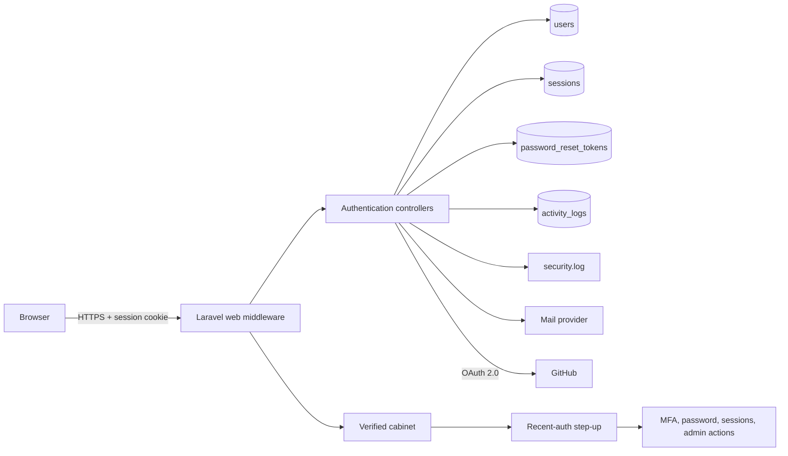

# Authentication and Account Security

## Purpose

This handbook is the canonical engineering and operations reference for the
application's authentication subsystem. It documents the behavior implemented
in the current Laravel codebase, the trust boundaries it establishes, and the
procedures required to operate it safely.

The subsystem provides:

- session-based authentication with email and password;
- normalized, verified email identities;
- signed email-verification links and password recovery;
- GitHub OAuth sign-in and explicit account linking;
- application-managed TOTP MFA with single-use recovery codes;
- recent-authentication step-up for sensitive actions;
- database-backed device session visibility and revocation;
- role and account-status enforcement;
- structured security audit events in the database and rotating log files;
- rate limits for public and sensitive authentication endpoints.

This documentation describes the web application. It does not define a token
API, Laravel Sanctum integration, or stateless JWT authentication.

## Documentation Map

| Document                        | Audience                          | Purpose                                                                        |
| ------------------------------- | --------------------------------- | ------------------------------------------------------------------------------ |
| [Architecture](architecture.md) | Engineers and reviewers           | Components, trust boundaries, flows, routes, data, and security controls       |
| [Audit Events](audit-events.md) | Security, support, and developers | Event catalog, metadata contract, visibility, and data-handling rules          |
| [Operations](operations.md)     | Operators and maintainers         | Environment configuration, deployment, monitoring, incidents, and key rotation |
| [Testing](testing.md)           | Engineers and reviewers           | Test ownership, coverage matrix, quality gates, and change checklist           |

## Security Objectives

The implementation is designed around the following objectives:

1. A valid first factor must not grant cabinet access when email verification,
   account status, or MFA requirements are incomplete.
2. Sensitive account and administrator actions require recent proof of the
   strongest available authentication method.
3. OAuth identity matching must never silently merge an existing local account.
4. Password changes, password resets, MFA changes, role changes, and account
   suspension must invalidate sessions as appropriate.
5. Authentication attempts must be rate-limited and auditable without logging
   passwords, OAuth tokens, TOTP values, recovery codes, or raw unknown emails.
6. A user must never be able to revoke or inspect another user's session through
   the account-security interface.

## System Boundary

The browser, email inbox, authenticator application, GitHub account, database,
cache/rate-limit store, mail transport, and application encryption key are all
separate trust boundaries. Compromise of any one boundary requires the response
described in [Operations](operations.md#incident-response).

## Source of Truth

When documentation and implementation disagree, treat the following as the
runtime source of truth and update this handbook in the same pull request:

- routes: `routes/web.php`;
- middleware registration: `bootstrap/app.php`;
- authentication limits and password policy: `app/Providers/AppServiceProvider.php`;
- auth timing: `config/auth_security.php`;
- session behavior: `config/session.php`;
- GitHub integration: `config/services.php`;
- user security state: `app/Models/User.php` and database migrations;
- authentication controllers: `app/Http/Controllers/Auth`;
- account-security controllers: `app/Http/Controllers/Cabinet`;
- security services: `app/Services`;
- regression coverage: `tests/Feature`.

## Ownership and Change Policy

Authentication changes require all of the following in one reviewable change:

- an explicit threat or product requirement;
- route and middleware review;
- validation, session lifecycle, and audit review;
- positive and negative feature tests;
- updates to this handbook when behavior, configuration, events, or operations
  change;
- successful execution of the quality gates listed in
  [Testing](testing.md#required-quality-gates).

Do not introduce alternate login paths, privileged bypasses, or manual database
edits as normal product workflows. Emergency access must be time-bounded,
peer-reviewed, logged, and followed by a permanent fix.
