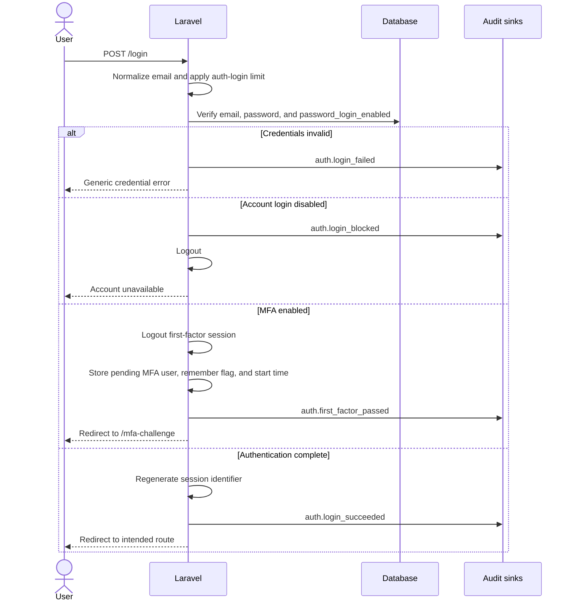

# Authentication Architecture

## Architectural Style

Authentication uses Laravel's stateful `web` guard with an Eloquent user
provider and server-side sessions. Controllers orchestrate framework primitives,
while focused services own session revocation, TOTP verification, recent-auth
state, and audit recording.

The primary control chain is:

```text
Route -> web middleware -> throttle -> controller -> service/model -> session/database -> audit
```

Cabinet authorization adds progressively stronger controls:

```text
auth -> login.enabled -> verified -> admin (when required) -> security.confirmed (for sensitive actions)
```

## Components and Responsibilities

| Component                        | Responsibility                                                                                                          |
| -------------------------------- | ----------------------------------------------------------------------------------------------------------------------- |
| `AuthenticatedSessionController` | Password login, MFA handoff, logout, session regeneration, and login audit events                                       |
| `RegisteredUserController`       | Normalized registration, password policy, initial login, and verification notification                                  |
| `PasswordResetLinkController`    | Enumeration-resistant password-reset requests                                                                           |
| `NewPasswordController`          | Token-based password reset and full session revocation                                                                  |
| Email verification controllers   | Verification prompt, notification resend, signed-link fulfillment, and audit                                            |
| `GitHubOAuthController`          | OAuth state validation, verified GitHub email lookup, explicit linking, OAuth-only account creation, and GitHub step-up |
| `MfaChallengeController`         | Time-bounded second-factor challenge before application login                                                           |
| `SecurityConfirmationController` | Recent proof through password, MFA, or eligible linked GitHub identity                                                  |
| `MfaController`                  | MFA enrollment, confirmation, recovery-code generation, and disablement                                                 |
| `PasswordController`             | Authenticated password rotation and other-session revocation                                                            |
| `SessionController`              | User-scoped device session revocation                                                                                   |
| `AuthSessionService`             | Database session deletion and remember-token rotation                                                                   |
| `MfaTokenVerifier`               | Transactional TOTP replay prevention and recovery-code consumption                                                      |
| `SecurityConfirmationService`    | Session-bound recent-auth state and expiry checks                                                                       |
| `SecurityAuditLogger`            | Database activity event plus structured security log entry                                                              |
| `EnsureLoginEnabled`             | Immediate logout of suspended authenticated accounts                                                                    |
| `EnsureSecurityConfirmed`        | Redirect to step-up before sensitive actions                                                                            |
| `EnsureAdmin`                    | Role boundary for administrator routes                                                                                  |

## Authentication State Model

An account's effective authentication state is derived from several independent
fields. No single boolean represents all security requirements.

| Field                      | Meaning                                                     |
| -------------------------- | ----------------------------------------------------------- |
| `email_verified_at`        | The application email identity has been verified            |
| `password_login_enabled`   | Password is an allowed first factor for this account        |
| `login_enabled`            | Administrators allow the account to sign in at all          |
| `github_id`                | A GitHub identity is explicitly linked                      |
| `mfa_secret`               | Encrypted TOTP seed exists                                  |
| `mfa_recovery_codes`       | Encrypted array containing one-way recovery-code hashes     |
| `mfa_confirmed_at`         | MFA enrollment was confirmed with a valid TOTP value        |
| `mfa_last_used_time_slice` | Last consumed TOTP time slice for replay prevention         |
| `role`                     | Application authorization role, currently `user` or `admin` |
| `remember_token`           | Laravel remember-me revocation token                        |

`User::hasMfaEnabled()` requires both an MFA secret and a confirmation timestamp.
`User::canLogIn()` reads the independent administrative `login_enabled` switch.
Emails are trimmed and lowercased by `User::normalizeEmail()` and again during
model persistence.

## Password Authentication Flow



The MFA challenge expires after `AUTH_MFA_CHALLENGE_TTL` seconds. Successful
verification consumes either a previously unused TOTP time slice or one recovery
code, logs the user in, regenerates the session identifier, and records both MFA
and completed-login events.

## Registration and Email Verification

Registration requires a name, normalized unique email, confirmed password, and
the global password policy. New password accounts receive role `user`, have
password login enabled, and are signed in immediately, but cabinet routes remain
blocked by Laravel's `verified` middleware until the signed email link is
fulfilled.

Verification routes require an authenticated, login-enabled account. Verification
links are signed and throttled. Resend requests are also throttled. The application
records registration, verification requests, and completed verification as
separate audit events.

## Password Recovery and Rotation

Password-reset requests normalize the email and always return the standard sent
status, regardless of whether an account exists. Laravel stores a hashed reset
token in `password_reset_tokens`; the configured token lifetime is 60 minutes and
token issuance is throttled to one per 60 seconds per account by the password
broker, in addition to the route-level recovery limiter.

A successful reset:

1. validates the token, normalized email, and global password policy;
2. enables password login for the account;
3. rotates the remember token;
4. revokes all database sessions;
5. dispatches Laravel's `PasswordReset` event;
6. records `auth.password_reset`.

An authenticated password change requires recent-auth step-up, applies the same
password policy, revokes other sessions, records `auth.password_changed`, and
clears the recent-auth confirmation.

## GitHub OAuth and Account Linking

GitHub OAuth uses authorization-code flow with session-bound `state`, scopes
`read:user user:email`, five-second connect timeouts, ten-second request timeouts,
and GitHub API version `2022-11-28`.

Only the primary verified GitHub email is accepted. Important identity rules:

- a matching email never silently links an existing account;
- an authenticated user must complete recent-auth step-up before linking;
- a GitHub ID or verified email already owned by another user blocks linking;
- linking does not replace the local account email;
- a new GitHub-only user receives a random inaccessible password and
  `password_login_enabled=false`;
- a disabled account cannot sign in through GitHub;
- application MFA, when enabled, still runs after GitHub first-factor success;
- GitHub can act as step-up only for an OAuth-only account that has neither a
  usable password nor application MFA, and the returned GitHub ID must match.

The application never stores the GitHub access token. It is held only for the
callback request while profile and verified-email data are fetched.

## MFA Design

Application MFA follows TOTP with SHA-1, six digits, a 30-second period, and a
verification window of one time slice before or after the current slice. This is
compatible with common authenticator applications.

Enrollment requires recent-auth step-up. The generated secret remains in the
setup session until a valid TOTP code confirms enrollment. On confirmation:

- the TOTP secret is encrypted using Laravel's application encryption;
- eight recovery codes are generated and shown once;
- only password hashes of recovery codes are retained inside an encrypted array;
- the enrollment TOTP slice is marked consumed;
- other sessions are revoked;
- recent-auth state is cleared.

`MfaTokenVerifier` locks the user row in a database transaction. A TOTP value is
accepted only when its time slice is newer than the last consumed slice. A
recovery code is removed atomically after its first successful use.

Disabling MFA also requires recent-auth step-up, removes all MFA material, revokes
other sessions, clears step-up state, and creates an audit event.

## Recent-Authentication Step-Up

Sensitive actions use `security.confirmed`. A successful proof is stored only in
the current server-side session as:

```text
auth.security_confirmation = user_id + confirmed_at + method
```

The default validity window is 900 seconds and is configurable with
`AUTH_STEP_UP_TTL`. The proof method is selected in this order:

1. application MFA when enabled;
2. password when password login is enabled;
3. matching linked GitHub identity for OAuth-only accounts.

Protected actions include MFA enrollment and disablement, password changes,
session revocation, GitHub linking, admin role approval/revocation, and account
login enable/disable operations.

## Sessions and Session Fixation

The default session driver is `database`. Login, registration, completed OAuth,
completed MFA, and GitHub linking regenerate the session identifier. Logout
invalidates the session and regenerates the CSRF token.

The account-security page lists sessions owned by the current user. Revocation
queries always include the authenticated user ID, and the current session cannot
be revoked through the single-session endpoint. Password reset and administrator
role or access changes revoke all sessions. Password or MFA changes revoke other
sessions while preserving the current confirmed operation.

Remember-me access is invalidated by rotating `remember_token` whenever the
session service performs broad revocation.

## Route and Middleware Contract

| Route group or endpoint   | Core middleware                                                     | Purpose                                       |
| ------------------------- | ------------------------------------------------------------------- | --------------------------------------------- |
| `POST /login`             | `guest`, `throttle:auth-login`                                      | Password first factor                         |
| `POST /register`          | `guest`, `throttle:auth-registration`                               | Account creation                              |
| Password recovery routes  | `guest`, `throttle:auth-recovery` on writes                         | Reset request and completion                  |
| `/mfa-challenge`          | `throttle:auth-mfa` on write                                        | Pending second-factor completion              |
| `/auth/github/*`          | `throttle:auth-oauth`                                               | GitHub sign-in, linking, and eligible step-up |
| `POST /logout`            | `auth`                                                              | Current-session termination                   |
| Email verification routes | `auth`, `login.enabled`, signed/throttled where applicable          | Verification gating                           |
| `/confirm-security`       | `auth`, `login.enabled`, `verified`, sensitive throttle on write    | Recent-auth proof                             |
| `/cabinet/*`              | `auth`, `login.enabled`, `verified`                                 | Authenticated product area                    |
| Sensitive security writes | Cabinet middleware, `security.confirmed`, `throttle:auth-sensitive` | Account security changes                      |
| `/cabinet/admin/*`        | Cabinet middleware, `admin`                                         | Administrator area                            |
| Sensitive admin writes    | Admin middleware, `security.confirmed`                              | Role and login-access changes                 |

All routes in `web.php` also receive Laravel's web middleware, including session
startup and CSRF protection. `SecurityHeaders` is appended to the web group.

## Rate Limits

| Limiter             | Keys and limits                                              |
| ------------------- | ------------------------------------------------------------ |
| `auth-login`        | 5/minute per normalized-email hash plus IP; 20/minute per IP |
| `auth-mfa`          | 5/minute per pending user plus IP; 20/minute per IP          |
| `auth-registration` | 3/minute and 10/hour per IP                                  |
| `auth-recovery`     | 3/minute per normalized-email hash plus IP; 20/hour per IP   |
| `auth-oauth`        | 10/minute and 60/hour per IP                                 |
| `auth-sensitive`    | 5/minute per authenticated user plus IP                      |

Multi-instance deployments must use a shared, reliable cache/rate-limit store so
limits cannot be bypassed by moving between application instances.

## Password Policy

All new and replacement passwords use the same Laravel default rule:

- at least 12 characters;
- letters;
- mixed uppercase and lowercase;
- numbers;
- symbols;
- matching confirmation field where applicable.

Passwords are stored using Laravel's `hashed` model cast or `Hash::make()`. Plain
passwords are never included in audit metadata.

## Known Limitations and Planned Hardening

The current implementation intentionally documents these gaps rather than
presenting them as completed controls:

- no passkeys/WebAuthn or phishing-resistant application factor;
- no user-facing GitHub disconnect workflow;
- no recovery-code regeneration workflow after the initial one-time display;
- no automated MFA recovery or identity-proofing process for lost devices;
- no automatic risk scoring, impossible-travel detection, or trusted-device model;
- no SIEM export or alert rules beyond the local structured log channel;
- no application-enforced retention policy for database `activity_logs`;
- standard-user suspension is available in the admin UI, but admin-account
  emergency suspension requires a controlled operational procedure;
- session listing and targeted revocation depend on the database session driver;
- the custom TOTP implementation is covered by tests but has not been replaced
  with a dedicated, independently maintained MFA package.

Treat additions in these areas as security design changes requiring threat-model,
migration, recovery, and backward-compatibility review.
